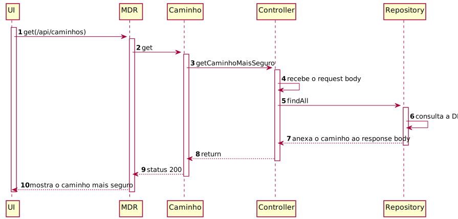

# UC19

##  Consultar o caminho mais seguro (garante que não há uma força de ligação inferior a x considerando as forças nos dois sentidos da ligação) para determinado utilizador.
### Como utilizador/jogador pretendo obter o caminho  mais seguro (garante que não há uma força de ligação inferior a x considerando as forças nos dois sentidos da ligação) até determinado utilizador.

