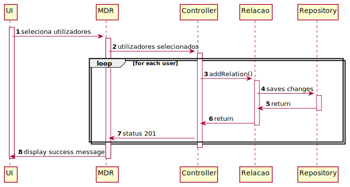

# UC 9

## Escolher “utilizadores objetivo” (sugeridos pelo sistema)

Como utilizador autenticado, pretendo poder escolher utilizadores objetivo sugeridos pelo sistema e adicioná-los à minha rede.

